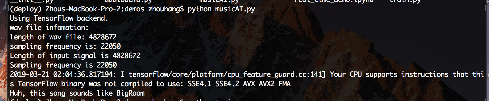
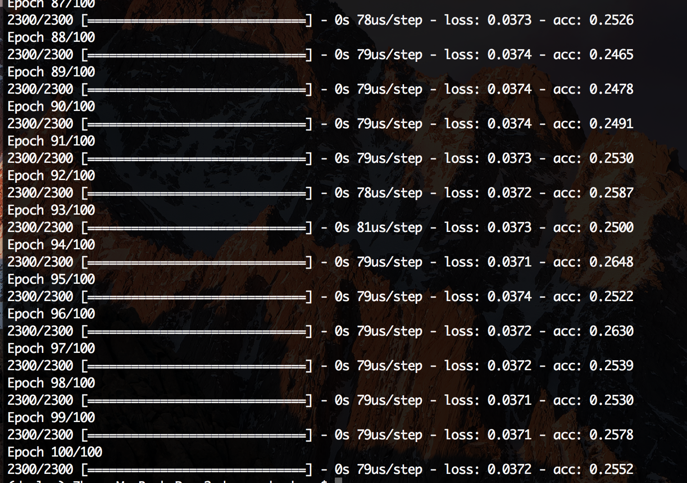

# shazam-air
~~music recognition and classifier project just like shazam but lighter and simpler~~

Music classifier project.

# Installation
## 1.clone this repository
`$ git clone https://github.com/vsc-hvdc/shazam-air.git`
## 2.create a conda environment using environment.yml in the project directory
`$ conda env create -f environment.yml -n $YOUR_ENV_NAME`
## 3.activate the environment
`$ source activate $YOUR_ENV_NAME`
## 4.add package to python search path
`$ conda develop /Your/Project/Path/shazam-air/src`

# Run Demos
    Note: all the demo dataset, model and wav files are provided under the `/data` directory. Feel free to record or import your own demo file though.
    
## 1.audioDemo
Just run the script in `demos/` directory

You should be able to see the plotting of two example audio file in time & frequency domain

## 2.musicAI
Run the script in `demos/` directory

You should be able to read the output of prediction electronic dance music genre.

You can choose to run it with example recordings `/dubsteps.wav` and `/future.wav` under `demos/demo_chunks/`.

But the model's accuracy is yet to improve, which will be discussed later.

The recommended method to run your model is to contruct your model outside the project, save your model data, and load it in this project. The interface for training your model is reserved but not completed now. Hope I can finish it sooner.

## 3.train
You can try training your own model by running the `train.py` script.

This project have already include the dataset to train the model. This dataset is downloaded from [kaggle](https://en.wikipedia.org/wiki/Kaggle), See more infomation about it [here](https://www.kaggle.com/caparrini/beatsdataset)

You should be able to see the training process in the terminal output. Plus you can see the PCA and LDA analysis of our dataset

The best model I trained reachs a accuracy of 80%. It's a good number for a dataset of only 2300 data when you try to classifiy 23 classes.

The advice is to create the dataset of your own (Yet the most tricky and impossible part is how you can access enough amount of music data), the original dataset is not fully reliable, but it's the best I can find.

Or you can just keep trying Tweaking Your Model!

## 4.real-time spectrum demo
This demo is recommended running on the jupyter notebook because I met some strange bugs when trying to run it by script.

You can open the terminal and run 
`$ jupyter notebook`, which should be installed when you create the env for this project in **installation step2**.

Open `real_time_demo.ipynb`, run through the demo, and you should be able to see a dynamic sepctrum while playing the demo chunk.

I found matplotlib extremely not good for real-time plotting cuz it's really slow and memory-consuming. The demo is the best I can do now, but still have obvious delay. Maybe we can try other library like openGL.

The spectrum is not ideal now cuz the y-axis is not fixed. Right now I can't figure out how to disable its auto-scaling setting.

